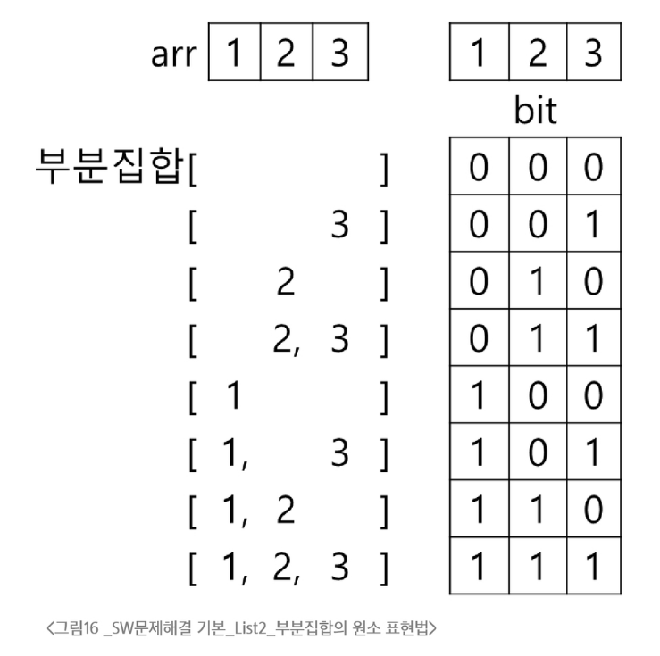
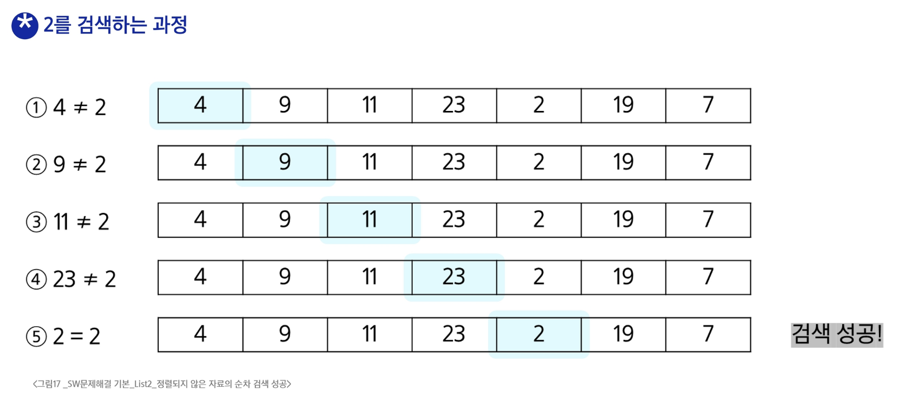
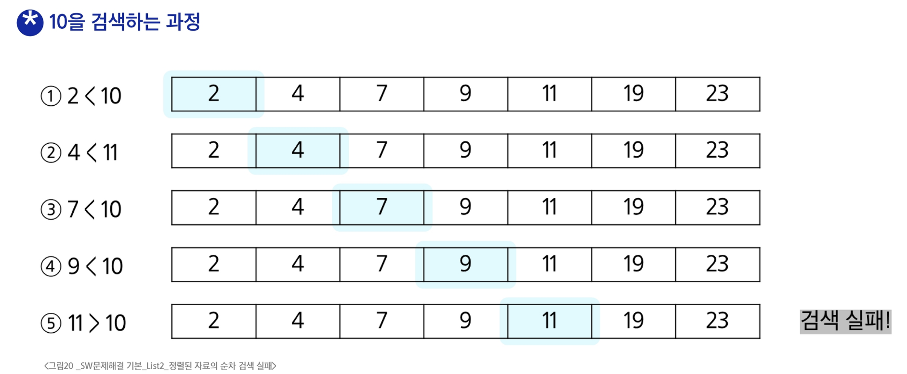

### 부분집합
- 부분집합 합 문제
  - 유한 개의 정수로 이루어진 집합이 있을 때, 이 집합의 부분집합 중에서 조건에 맞는 경우를 찾는 문제
  - 그 집합의 원소를 모두 더한 값 중에 0이 있는지를 판별
- 부분집합의 수
  - 집합의 원소가 n개일 때, 공집합을 포함한 부분집합의 수는 2^n개
- 부분집합의 원소를 표현하는 방법
  
  - arr[i] 원소가 부분집합에 포함되지 않으면 bit[i]==0
  - arr[i] 원소가 부분집합에 포함되면 bit[i]==1
- 각 원소가 부분집합에 포함되었는지를 loop를 이용하여 확인하고, 부분집합을 생성하는 방법
```python
def print_subset(bit):
    for i in range(4):
        if bit[i]:       # bit[i]!=0:과 같은 표현. bit[i]가 0이 아니면 True값을 반환함
            print(arr[i], end = ' ')
    print()

arr = [7, 5, 8, 1]

bit = [0, 0, 0, 0]
for i in range(2):
    bit[0] = i
    for j in range(2):
        bit[1] = j
        for k in range(2):
            bit[2] = k
            for l in range(2):
                bit[3] = l
                print_subset(bit)
```
- 비트 연산자
  - & : 비트 단위로 AND 연산
  - | : 비트 단위로 OR 연산
  - << : 피연산자의 비트 열을 왼쪽으로 이동
    - 1 << 3 : 1을 왼쪽으로 3칸 이동한다는 의미. 이동하고 남은 공간은 0을 채움
  - \>> : 피연산자의 비트 열을 오른쪽으로 이동
- << 연산자 활용
  - 1 << n : 2^n 즉, 원소가 n개일 경우의 모든 부분집합의 수를 의미
    - 2진수에서 각 자리는 2^n을 의미
    - 예를 들어. 0101은 2^2 + 2^0임
- & 연산자 활용
  - i & (1\<\<j) : i의 j번째 비트가 1인지 아닌지를 검사
- 비트 연산으로 부분집합을 생성하는 방법
```python
arr = [3, 6, 7, 1, 5, 4]

n = len(arr)        # n : 원소의 개수

for i in range(1<<n):       # 1<<n : 부분 집합의 개수
    for j in range(n):      # 원소의 수만큼 비트를 비교함
        if i & (1<<j):      # i의 j번 비트가 1인경우
            print(arr[j], end = ", ")       # j번 원소 출력
    print()
print()
```

### 순차 검색
- 순차 검색
  - 일렬로 되어있는 자료를 순서대로 검색하는 방법
  - 가장 간단하고 직관적인 검색 방법이지만, 검색 대상의 수가 많아지면 수행시간이 급격히 증가하여 비효율적임
  - 배열이나 연결 리스트 등 순차구조로 구현된 자료구조에서 원하는 항목을 찾을 때 유용
  - 검색대상이 정렬되어 있는지에 따라 방법이 달라짐
- 정렬되어 있지 않은 경우 순차 검색
  - 첫번째 원소부터 순서대로 검색 대상과 키 값이 같은 원소가 있는지 비교하며 찾음
  - 키 값이 동일한 원소를 찾으면 그 원소의 인덱스를 반환
  - 자료구조의 마지막에 이를 때까지 검색 대상을 찾지 못하면 검색 실패
  - 순차 검색 성공 시 평균 비교횟수는 (n+1)/2
  - 순차 검색 실패 시 마지막까지 비교하므로 평균 비교횟수는 n
  - 검색 예시

```python 
def sequential_search(a, n, key):
    for i in range(n):
        if key==arr[i]:
            return i
    return -1
```
- 정렬되어 있는 경우 순차 검색
  - 자료가 오름차순으로 정렬된 상태에서 검색을 실시함
  - 자료를 순차적으로 검색하면서 키 값을 비교하여, 원소의 키 값이 검색 대상의 키 값보다 크면 찾는 원소가 없다는 것이므로, 더 이상 검색하지 않고 검색을 종료한다.
  - 찾고자하는 원소의 순서에 따라 비교횟수가 결정됨
  - 검색 예시

  - 정렬이 되어있으므로, 검색 실패를 반환하는 경우에도 평균 비교횟수가 반으로 줄어듬. (n+1)/2

### 이진 검색
- 이진 검색
  - 자료의 가운데에 있는 항목의 키 값과 비교하여 다음 검색의 위치를 결정하고 검색을 계속 진행하는 방법
    - 목적 키를 찾을 때 까지 이진검색을 순환적으로 반복수행하며 검색 범위를 반으로 줄임
  - 자료가 정렬된 상태여야 사용 가능
- 검색 과정
  - 자료의 중앙에 있는 원소를 고른다.
  - 중앙 원소의 값과 찾고자 하는 목표 값을 비교한다.
  - 목표 값이 중앙 원소보다 작으면 자료의 왼쪽 반에, 크면 오른쪽 반에 새로 검색을 수행한다.
  - 값을 찾을 때 까지 반복한다.
- 이진 검색 알고리즘 구현
```python
def binarySearch(a, N, key):    # key를 찾으면 인덱스를, 실패하면 -1을 반환
    start = 0
    end = N-1
    while start <= end:
        middle = (start + end)//2
        if a[middle] == key:    # 검색 성공
            return middle
        elif a[middle] > key:   # 찾는 값보다 크면 
            end = middle -1     # 왼쪽 구간을 선택
        else:    # 찾는 값보다 작으면
            start = middle + 1      # 검색 실패
    return -1
```
### 선택 정렬
- 선택 정렬
  - 주어진 자료들 중 가장 작은 값의 원소부터 차례대로 선택하여 위치를 교환하는 방식
- 정렬 과정
  - 주어진 리스트 중에서 최솟값을 찾기
  - 그 값을 리스트의 맨 앞에 위치한 값과 교환
  - 맨 처음 위치를 제외한 나머지 리스트를 대상으로 과정을 반복
- 시간복잡도 O(n^2)
- 선택 정렬 구현
```python
def selection_sort(a, N):
    for i in range(N-1):     # 정렬 구간의 시작 인덱스
        min_idx = i        # 첫 원소를 최소로 가정
        for j in range(i+1, N):
            if a[min_idx] > a[j]:   # 최소 원소 위치 갱신
                min_idx = j
        a[i], a[min_idx] = a[min_idx], a[i]     # 구간 최솟값을 구간 맨 앞으로
```

### 셀렉션 알고리즘
- 셀렉션 알고리즘
  - 저장되어 있는 자료로부터 k번째로 큰 혹은 작은 원소를 찾는 방법
  - 1번부터 k번째까지 정렬하고, 배열의 k번째를 반환한다.
  - k가 비교적 작을 때 유용하며, O(kn)의 수행시간을 필요로 한다.
- 선택 과정
  - 정렬 알고리즘을 이용하여 자료 정렬하기
  - 원하는 순서에 있는 원소 가져오기
- k번째로 작은 원소를 찾는 알고리즘
```python
def select(arr, k):
    for i in range(0, k):
        min_index = i
        for j in range(i+1, len(arr)):
            if arr[min_index] > arr[j]:
                min_index = j
        arr[i], arr[min_index] = arr[min_index], arr[i]
    return arr[k-1]
```
