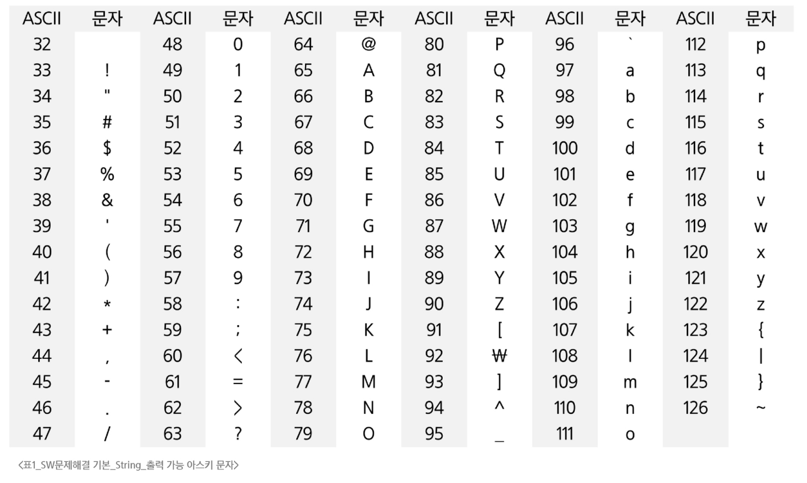
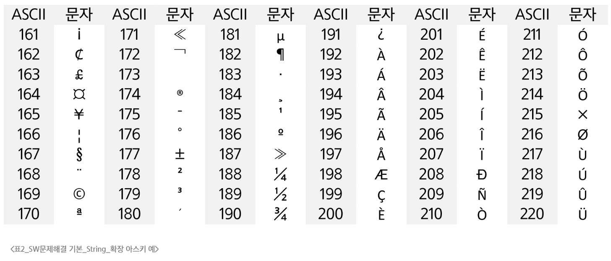
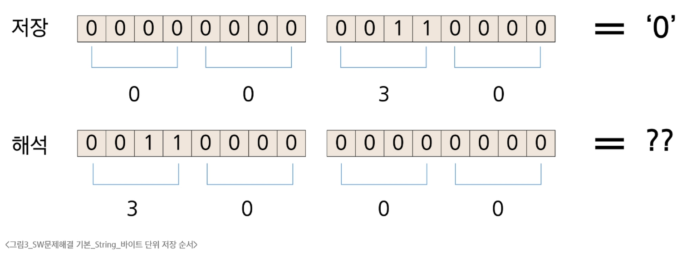
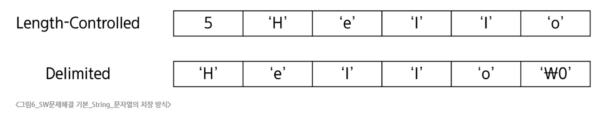

### 코드체계
- 코드체계
  - 문자에 대응되는 숫자를 정한 것
- 코드 체계의 문제와 개선
  - 네트워크가 발전되기전 미국은 각 지역별로 코드체계를 정해놓고 각각 사용
    - 서로 정보를 주고받을 때 정보를 다르게 해석하는 문제가 발생
  - 혼동을 피하기 위해 ASCII라는 문자 인코딩 표준이 제정됨
- 아스키(ASCII)
  - ASCII는 7-bit 인코딩으로 128문자를 표현하며 33개의 출력 불가능한 제어 문자들과 공백을 비롯한 95개의 출력 가능한 문자들로 이루어짐
  - 출력 가능 아스키 문자
  
- 확장 아스키(Extended ASCII)
  - 표준 문자 이외의 악센트 문자, 도형 문자, 특수 문자, 특수 기호 등 부가적인 문자를 128개 추가
  - 확장 아스키는 1Byte 내의 8-bit를 모두 사용함으로써 추가적인 문자를 표현할 수 있음
  - 컴퓨터 생산자와 소프트웨어 개발자가 여러 거지 다양한 문자에 할당할 수 있도록 함
    - 이렇게 할당된 확장 부호는 표준 아스키처럼 서로 다른 프로그램이나 컴퓨터 사이에 교환되지 못함
  - 표준 아스키 마이크로컴퓨터 하드웨어 및 소프트웨어 사이에서 세계적으로 통용되는데 비해, 확장 아스키는 프로그램이나 컴퓨터 또는 프린터가 그것을 해독할 수 있도록 설계되어 있어야만 올바로 해독될 수 있음
  - 확장 아스키 예
  
- 유니코드
  - 컴퓨터가 발전하며 미국 뿐 아니라 각 나라에서 컴퓨터가 발전
  - 각 국가들은 자국의 문자를 표현하기 위해 코드체계를 만들어서 사용하게 되었는데, ASCII를 만들기 전과 같은 문제가 국가 사이에 정보를 주고받을 때 발생
    - 우리나라도 한글 코드체계를 만들어 사용했고, 조합형과 완성형 두 종류를 가지고 있었음
  - 다국어 처리를 위해 표준인 유니코드를 만듦
- 바이트 단위 저장 순서
  - 여러 바이트로 이루어진 데이터를 저장하는 방식을 Endian이라고 함
  - Big-endian은 상위바이트(MSB)**를 가장 낮은 주소에 저장
  - Little-endian은 하위바이트(LSB)**를 가장 낮은 주소에 저장
  
- 유니코드 인코딩
  - UTF-8 (in web)
    - MIN : 8-bit, MAX : 32-bit(1 Byte * 4)
    - 필요한 크기에 따른 저장 방법 예
      - 0xxxxxxx
      - 110xxxxx 10xxxxxx
      - 1110xxxx 10xxxxxx 10xxxxxx
      - 11110xxx 10xxxxxx 10xxxxxx 10xxxxxx
  - UTF-16 (in windows, java)
      - MIN : 16-bit, MAX : 32-bit(2 Byte * 2) 
  - UTF-32 (in unix)
      - MIN : 32-bit, MAX : 32-bit(4 Byte * 1)
  - 윈도우는 CR(13)과 LF(10) 두 글자를 사용
  - Unix와 macOS는 LF(10) 한 글자를 사용
- Python 인코딩
  - UTF-8
    - 2.x 버전은 기본 인코딩 방식이 ASCII로, UTF-8 사용시 코드 첫줄에 다음 문장을 추가해야 함
      - #-8- coding: utf-8 -*-
    - 3.x 버전은 UTF-8 방식이 기본이므로 표시 생략
  - 다른 인코딩 방식으로 처리시 첫 줄에 작성하는 항목에 원하는 인코딩 방식을 지정해주면 됨

### 문자열
- 문자열의 분류
  - Length-Controlled 문자열
    - 문자열의 길이 정보를 함께 저장해서, 그 길이만큼 문자 데이터를 읽는 방식
    - Java, Python, 네트워크 패킷에 사용
  - Delimited 문자열
    - 문자열의 끝을 나타내는 특정한 구분자(Delimiter)가 있어서, 구분자가 나올 때까지 문자열로 인식
    - C언어는 널문자(null, '\0')를 사용
    
- 파이썬 str 클래스 구조
  - 길이 외에 다른 정보도 저장
    - PyObject_HEAD: 모든 Python 객체가 상속하는 공통 구조
    - length: 문자열의 길이
    - hash: 문자열의 해시값으로, 딕셔너리 키로 쓸 때 사용
    - interned: 같은 문자열을 관리하는 플래그
    - kind: 문자열 인코딩의 크기
    - data: 문자열이 저장된 실제 메모리 주소를 가리키는 포인터
- C언어에서 문자열
  - 문자열은 문자들의 배열 형태로 구현된 응용 자료형
  - 문자배열에 문자열을 저장할 때는 항상 마지막에 끝을 표시하는 널문자가 필요
  - 문자열 처리에 필요한 연산을 함수 형태로 제공
- Java에서의 문자열
  - 문자열 데이터를 저장, 처리해주는 클래스를 제공
  - String 클래스
    - String str="abc";// 또는 String str = new String("abc")
  - 문자열 처리에 필요한 연산을 연산자, 메소드 형태로 제공
- Python3에서의 문자열
  - 텍스트 데이터의 취급방법이 통일되어 있음
    - 유니코드 기반이라 어떤 언어나 기호도 동일한 방식으로 처리
  - 문자열 기호
    - ', ", ''', """
  - 연산
    - +연결으로 문자열과 문자열을 이어 붙일 수 있음
    - *반복으로 문자열을 반복시킬 수 있음
  - 문자열은 데이터의 숭서가 구분되는 시퀀스 자료형으로 분류
  - 문자열 클래스에서 제공되는 메서드
    - replace(), split(), isalpha(), find()
  - 문자열은 튜플과 같이 요소값을 변경할 수 없음
- C, Java, Python3 문자열의 차이
  - C는 아스키 코드로 저장
    - 한글을 출력할 수 있으나 콘솔의 도움을 받아야 함
  - Java는 유니코드(UTF-16, 2-Byte)로 저장
  - Python3는 유니코드(UTF-8)로 저장